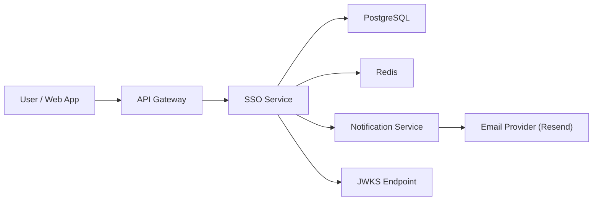

# SSO Service

Authentication service for OrderNest.

Default local URL: `http://localhost:8090`

## What it does
- Register and verify users
- Login, refresh token, logout
- Password reset flow
- Exposes JWKS for JWT verification

## Quick start
1. Start dependencies:
```bash
docker compose up -d
```
2. Run service:
```bash
./gradlew bootRun
```

## Required config
This service can load secrets from:
- `./etc/secrets/config.properties`
- `/etc/secrets/config.properties`

Common notification-related keys:
- `NOTIFICATION_BASE_URL`
- `NOTIFICATION_EMAIL_PATH`
- `VERIFICATION_BASE_URL`
- `VERIFICATION_PATH`
- `PASSWORD_RESET_BASE_URL`
- `PASSWORD_RESET_PATH`

## API + Swagger
- Swagger UI: `http://localhost:8090/swagger-ui/index.html`
- OpenAPI JSON: `http://localhost:8090/v3/api-docs`
- Health: `http://localhost:8090/actuator/health`

## Postman
Import:
- `postman/sso-service.postman_collection.json`

Notes:
- Verification and reset tokens come from email links.
- Paste tokens into Postman variables `verificationToken` and `resetToken`.

## Mermaid design

